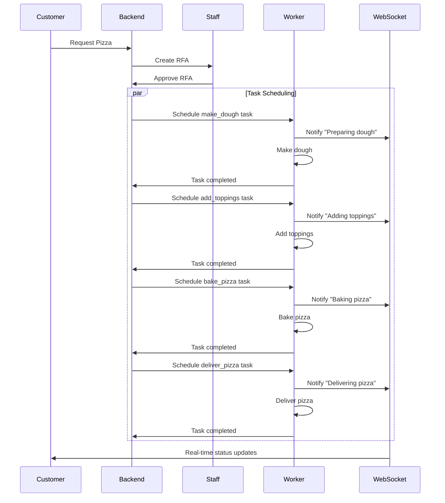

# Collate hiring test
Welcome to the take-home test for Python engineers!

In this repository you will find the source code for an application that is representative of the work you would have to do.

For the sake of this exercise, we are a high-tech pizza company.
We are developing an application to make and serve pizzas through an automatic process.

This is the flow:
1. Customer requests a pizza
2. Staff has to approve or decline the request (RFA)
3. Once approved, the commands are being sent to the pizza factory so they can execute each step:
  - Make the dough
  - Add the toppings
  - Bake the pizza
  - Deliver it

## Goal
Your goal is to implement the missing steps in the provided code.
Also, create a diagram on how the task scheduling works.

## Constraints
- All the code should be added and commited into this repository, in a new branch.
- The `Pizza` class can be modified if needed, but not the RFA, Task or Operation.
- We want our customers to be updated at every relevant step of the process. Do it via websockets.
- Feel free to create new worker interfaces if needed, but the processes should be non-blocking.

## Task Scheduling Diagram



The diagram above shows how tasks are scheduled and executed in our pizza ordering system:

1. The process starts when a customer requests a pizza through the backend
2. Staff receives an RFA (Request For Approval) to approve/decline the order
3. Once approved, the backend schedules a series of tasks:
   - make_dough
   - add_toppings
   - bake_pizza
   - deliver_pizza
4. Each task:
   - Is executed by a worker
   - Sends real-time updates via WebSocket
   - Reports completion back to the backend
5. The customer receives real-time updates throughout the process

Key features:
- Non-blocking execution through async workers
- Real-time customer updates via WebSocket
- Task status tracking and error handling
- Scalable worker architecture


## Setup: Make .envrc with following vars
```
export SECRET_KEY=
export REDIS_HOST=
export DATABASE_URL=
export SERVER_URL=http://localhost:8000
export WORKER_TOKEN=test_worker_token
```
